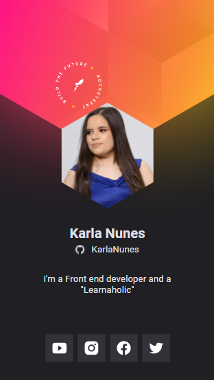
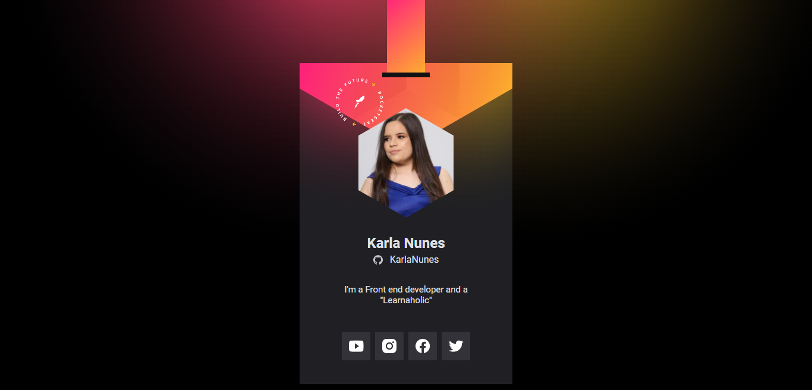

# 📌 Virtual Badge

## Visuals

 

## Description

The project is a virtual badge of Rocketseat's 'DoWhile 2021' event and was developed during the 7th NLW classes. It allows you to see information such as name, photo, description and links to social networks.
Some of this information comes from Github.

## Techs

- HTML
- CSS
- JavaScript

## Contributing

Pull requests are welcome.
